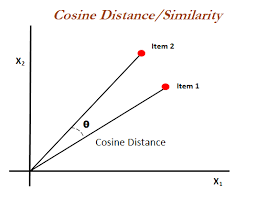

# Movie-Recommendation-System

This is a a content based movie recommendation system using cosine similarity made during the [Microsoft Engage Mentorship Program 2022](https://acehacker.com/microsoft/engage2022/).

## 🚩 Problem Statement

Demonstrate through your app the different kinds of algorithms that a web-streaming app (like Netflix) or an audio-streaming app (like Spotify) may use for their Recommendation Engine.

## 🚩 Definition of Recommender Systems:

Recommendation systems are a collection of algorithms used to recommend items to users based on information taken from the user. These systems have become ubiquitous, and can be commonly seen in online stores, movies databases and job finders. In this notebook, we will explore Content-based recommendation systems and implement a simple version of one using Python, Pandas library.

**Content Based Recommender Systems:**: A Content-based recommender system tries to recommend items to users, based on their profile. The user’s profile revolves around the user’s preferences and tastes, or based on the user ratings.

## 🚩 Approach

The problem was divided into several steps:

1. **Data Collection:** Data was collected from the Kaggle website : [TMDB 5000 Movie Dataset](https://www.kaggle.com/tmdb/tmdb-movie-metadata). This provides us with data on the plot, cast, crew, budget, and revenues of several thousand films. This dataset was generated from The Movie Database API.

2. **Data Wrangling:** The datasets were uploaded to a dataframe and explored. Null values were filled in wherever appropriate and polluted values were discarded or wrangled.

3. **EDA:** Extensive data visualisation and summary statistics were used to extract insights and pattern from the various datasets.

4. **Using the Cosine Similarity:** We will use the Cosine Similarity from Sklearn, as the metric to compute the similarity between two movies.

5. **Machine Learning:** I brought together ideas from content based filtering to build an engine that gave movie suggestions to a user based on the estimated ratings that it had internally calculated.

<p align="center">
    
</p>

## 🚩 How cosine similarity works in my project?

Cosine similarity is a metric used to measure how similar the documents are irrespective of their size. Mathematically, it measures the cosine of the angle between two vectors projected in a multi-dimensional space. The cosine similarity is advantageous because even if the two similar documents are far apart by the Euclidean distance (due to the size of the document), chances are they may still be oriented closer together. The smaller the angle, higher the cosine similarity.

The python Cosine Similarity or cosine kernel, computes similarity as the normalized dot product of input samples X and Y. We will use the sklearn cosine_similarity to find the cos θ for the two vectors in the count matrix.

<p align="center">
    
</p>

The idea is to

1. Compute the cosine similarity of the given movie and the whole movies' feature matrix
2. Return top k max similarity values
3. Select randomly to make sure each recommendation id distinct

## 🚩 How I used agile methodology in my project?

Agile is a methodology adopted today in the software industry which promotes teamwork, flexible procedures, and a sle-organizing team.

How I achieved agile methodology?

- As the project is made by an individual i.e. me with the support of mentor, so I first considered myself as a team.
- As in Agile methodology, the development cycle is broken down into sprints and divided tasks📌 according.

  - **Sprint 1** -

    - [x] Research on the various types of recommendation systems
    - [x] Have a meet with mentor and ask necessary doubts
    - [x] Basic overview of how the web app look like

  - **Sprint 2** -

    - [x] Research on cosine similarity
    - [x] Searched various databases and selecting a suitable one
    - [x] Setup jupyter notebook
    - [x] Analysed the database and setup the features list

  - **Sprint 3** -

    - [x] Combined relevant features into a single feature
    - [x] Extarct features from data using sklearn.feature_extraction module
    - [x] Bug Fixes
    - [x] Use the Cosine Similarity as the metric to compute the similarity between two movies.
    - [x] Working on content user likes
    - [x] Sorting the list and printing

  - **Sprint 4** -

    - [x] Running the entire code
    - [x] Bug fixes
    - [x] Plan and design how the web app should look like
    - [x] Streamlit framework
    - [x] Deployement on heroku
    - [x] Make a video for submission and create a Readme.md file

## 🚩 Technologies Used

<p align="center">
  
  
  
  
  
</p>

## 🚩 Why I choose these technologies?

[Pandas](https://pandas.pydata.org/) is an open-source library that is made mainly for working with relational or labeled data both easily and intuitively. It provides various data structures and operations for manipulating numerical data and time series. This library is built on top of the NumPy library. Pandas is fast and it has high performance & productivity for users.

[Natural Language Toolkit(NLTK)](https://www.nltk.org/) is a leading platform for building Python programs to work with human language data. It provides easy-to-use interfaces to over 50 corpora and lexical resources such as WordNet, along with a suite of text processing libraries for classification, tokenization, stemming, tagging, parsing, and semantic reasoning, wrappers for industrial-strength NLP libraries, and an active discussion forum.

[Scikit-learn](https://scikit-learn.org/) is the most useful and robust library for machine learning in Python. It provides a selection of efficient tools for machine learning and statistical modeling including classification, regression, clustering and dimensionality reduction via a consistence interface in Python. This library, which is largely written in Python, is built upon NumPy, SciPy and Matplotlib.

[Numpy](https://numpy.org/) which stands for Numerical Python, is a library consisting of multidimensional array objects and a collection of routines for processing those arrays. Using NumPy, mathematical and logical operations on arrays can be performed. This tutorial explains the basics of NumPy such as its architecture and environment. It also discusses the various array functions, types of indexing, etc. An introduction to Matplotlib is also provided. All this is explained with the help of examples for better understanding.

[Streamlit](https://streamlit.io/) is an open-source Python library that makes it easy to create and share beautiful, custom web apps for machine learning and data science. Streamlit turns data scripts into shareable web apps in minutes.

## 🚩 Final Result

The web app is hosted on Heroku.

[](https://movie-rec-sy.herokuapp.com/)

<p align="center">
    
    
    
</p>

## 🚩 Run Locally

This is how you can run this project in your local machine.

Clone the project

```bash
  git clone https://github.com/parthrastogi15/movie-recommendation-system.git
```

Go to the project directory

```bash
  cd movie-recommendation-system
```

Install requirements

```bash
  pip install -r requirements.txt
```

Running the project

```bash
  Streamlit run app.py
```

## 🚩 Contributing

Contributions are what make the open source community such an amazing place to be learn, inspire, and create. Any contributions you make are **greatly appreciated**.

    1. Fork the Project
    2. Create your Feature Branch (`git checkout -b feature/AmazingFeature`)
    3. Commit your Changes (`git commit -m 'Add some AmazingFeature'`)
    4. Push to the Branch (`git push origin feature/AmazingFeature`)
    5. Open a Pull Request

## 🚩 Feedback

If you have any feedback, please reach out to me at parthrastogi15@gmail.com

You can also fill the **feedback form** - [link](https://docs.google.com/forms/d/e/1FAIpQLSflF5_nrRpeojbASKt8vreyrACvbtRh0e0OldmOaSueTTH21w/viewform?usp=sf_link)

## 🚩 Acknowledgements

- [Microsoft Engage Mentorship Programs 2022](https://acehacker.com/microsoft/engage2022/)

  I would like to thank Microsoft for providing such a great opportunity where I had to learn a lot from my mentor [Parvinder Kaur](https://www.linkedin.com/in/kaur-parvinder/) through amazing live sessions.

- [Pandas](https://pandas.pydata.org/)
- [Natural Language Toolkit(NLTK)](https://www.nltk.org/)
- [Scikit-learn](https://scikit-learn.org/)
- [Numpy](https://numpy.org/)
- [Streamlit](https://streamlit.io/)
- [All libraries in `requirements.txt`](https://github.com/parthrastogi15/movie-recommendation-system/blob/main/requirements.txt)
